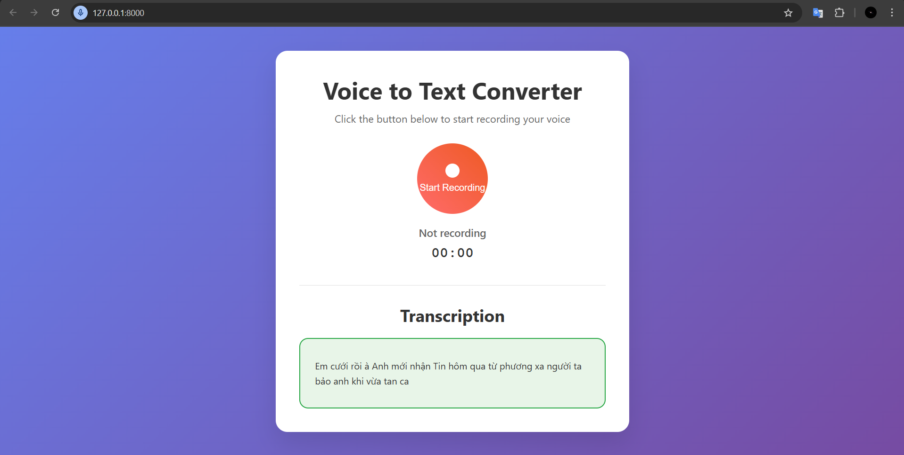

# Django Voice Recorder

## Main point:
This application can record and convert your voice into Vietnamese text.

## Features:
- Voice recording directly from your browser.
- Automatic conversion of recorded audio into Vietnamese text using speech-to-text technology.
- Simple and intuitive user interface for easy audio recording and text extraction.

## Demo

Below is a demo image from the `Demo` folder:



## Getting Started

### Prerequisites
- Python 3.x
- Django framework
- Required Python packages (specified in `requirements.txt` if available)

### Installation
1. Clone this repository:
   ```
   git clone https://github.com/lehau007/InternProgress.git
   ```
2. Navigate to the `Final` directory:
   ```
   cd InternProgress/Final
   ```
3. (Optional) Create and activate a virtual environment:
   ```
   python -m venv venv
   source venv/bin/activate  # On Windows use 'venv\\Scripts\\activate'
   ```
4. Install dependencies:
   ```
   pip install -r requirements.txt
   ```

### Usage
1. Start the Django development server:
   ```
   python manage.py runserver
   ```
2. Open your browser and go to `http://localhost:8000`.
3. Use the web interface to record your voice and receive Vietnamese text transcription.

## Folder Structure
- `Final/`: Contains the Django app for the voice recorder and converter.
- `Demo/`: Contains demo images such as `demo_img.png`.
- Other supporting files and scripts for deployment and development.

## License
Apache 2.0.

## Author
- [lehau007](https://github.com/lehau007)

## Repository
- [InternProgress](https://github.com/lehau007/InternProgress)
